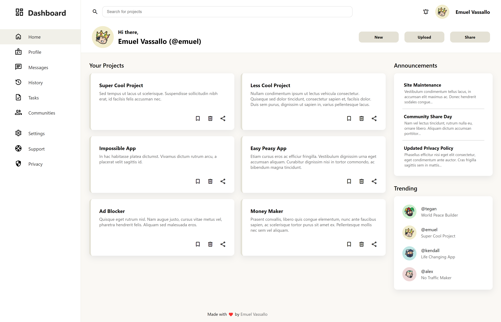

# Admin Dashbord

An admin dashboard made with CSS grid as part of The Odin Project's [curriculum](https://www.theodinproject.com/lessons/node-path-intermediate-html-and-css-admin-dashboard).

## Showcase

## Live Demo

👉 **Preview:** https://emuel-vassallo.github.io/admin-dashboard/

## Built With

- HTML
- CSS

## What I Learned

- Using CSS Grid along with Flexbox
- Using CSS Grid to create a full layout
- Using nested Grids and Flex containers inside Grids
- Using symbols by importing them through a stylesheet

## Credits

- [Profile pictures](https://dribbble.com/shots/3966719-The-Team) from [Dario Perić](https://dribbble.com/Bubily)
- [Google&#39;s Material Symbols](https://fonts.google.com/icons?icon.style=Rounded)
- [Finance Dashboard Design](https://dribbble.com/shots/16007029-Finance-Dashboard-Design) by [Ghulam Rasool](https://dribbble.com/ghulaam-rasool)
